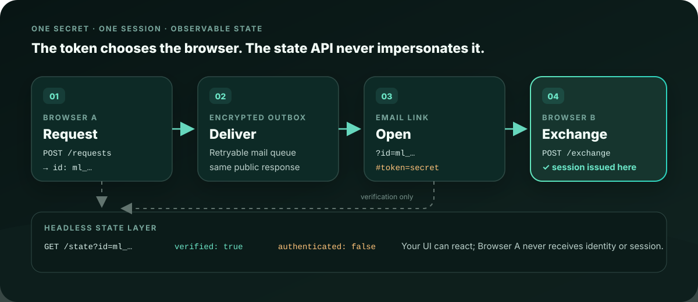
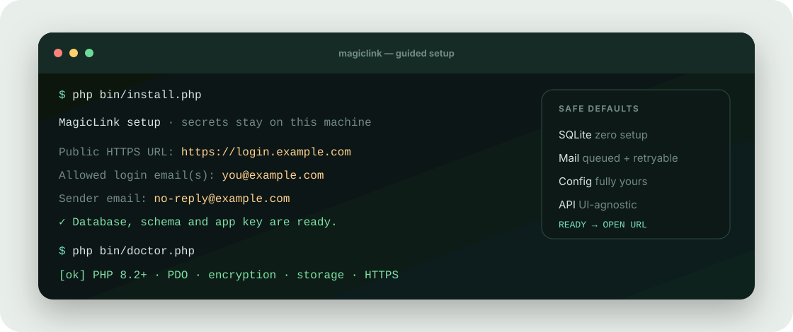

<p align="center">
  
</p>

<p align="center">
  <a href="README.de.md"></a>
</p>

<p align="center">
  <a href="https://github.com/angusu-de/MagicLink-CI/actions/workflows/ci.yml"></a>
</p>

<h1 align="center">MagicLink</h1>

<p align="center"><strong>Passwordless sign-in that starts as small on shared hosting as it does on a VPS — with your UI, your configuration and none of the infrastructure showing through.</strong></p>

<p align="center">
  <a href="https://github.com/IamAngusU/MagicLink/releases/latest"><strong>Download the ready-to-upload ZIP</strong></a>
  · <a href="docs/API.md">Headless API</a>
  · <a href="docs/CONFIGURATION.md">Configuration</a>
  · <a href="docs/OPERATIONS.md">Operations</a>
  · <a href="SECURITY.md">Security</a>
</p>

<p align="center"><a href="https://github.com/IamAngusU/icon-marquee"></a></p>

## Problem

A small login quickly grows password resets, credential stuffing, sessions, CSRF,
mail failures, account enumeration and retention concerns. Many magic-link snippets
also put the token in server logs or authenticate the wrong browser.

## Solution

MagicLink hides that machinery behind a small, versioned API:

- the secret stays in the URL fragment and is consumed only by a protected POST;
- only the device that opens the link receives the authenticated session;
- state and batch endpoints provide stable codes for your own UI without exposing
  an identity or token;
- mail uses an encrypted outbox with retries and the same public behavior for
  allowed and denied addresses;
- built-in English and German mail can be replaced with local, plain UTF-8
  templates and previewed without sending;
- an optional RP-initiated, state- and PKCE-bound handoff gives another backend
  the verified identity without sharing either application's session cookie;
- rate limits, request sizes, proxy trust, sessions, CORS and retention ship with
  safe defaults and remain fully configurable through `.env`;
- an explicit global request budget and bounded pending-mail queue apply
  backpressure before overload; `auto` sizes queue and batch limits for SQLite or
  MySQL, while explicit values win.

No framework and no Composer requirement: PHP 8.2+, PDO and Sodium or OpenSSL.

<p align="center"></p>

## Running in three minutes

1. [Download the current ready-to-upload ZIP](https://github.com/IamAngusU/MagicLink/releases/latest/download/magiclink-shared-hosting.zip) and upload it.
2. With shell access, run `php bin/install.php` and answer three questions.
3. Without a shell, copy `.env.example` to `.env` and set three values:

```dotenv
APP_URL=https://login.example.com
MAIL_FROM_ADDRESS=no-reply@example.com
MAGICLINK_ALLOWED_EMAILS=you@example.com
```

4. Open the domain. SQLite, the schema and the application key are created automatically.

<p align="center"></p>

Point the document root at `public/` when your host allows it. A root fallback for
traditional Apache hosting is included. See [shared hosting](docs/SHARED-HOSTING.md)
or [VPS deployment](docs/VPS.md) for details.

## Bring your own UI

```js
const api = "https://login.example.com/api/v1";
const config = await fetch(`${api}/config`, { credentials: "include" })
  .then(r => r.json());

const request = await fetch(config.data.endpoints.request, {
  method: "POST",
  credentials: "include",
  headers: {
    "Content-Type": "application/json",
    "X-CSRF-Token": config.data.csrf_token
  },
  body: JSON.stringify({ email: "you@example.com" })
}).then(r => r.json());
```

Poll `GET /api/v1/state?id=…` using the interval returned in
`meta.poll_after_ms`, or group requests through `POST /api/v1/states`. Every
response uses the same envelope: `{ ok, code, data, error, meta }`.

All endpoints, states, CORS rules and a complete browser flow are documented in
the [headless API reference](docs/API.md).

For a separate backend, enable the optional server handoff. That backend starts
the transaction, binds expected `state` and PKCE verifier to the initiating RP
browser session, and sends the browser to the returned authorization URL. That
same browser signs in;
the callback verifies `state`, exchanges the short-lived code, removes it from
the URL and creates its own session. See the [integration guide](docs/INTEGRATION.md).

## Make the mail yours

Copy `resources/mail-templates` to `storage/mail-templates`, edit the raw
`subject.txt`, `plain.txt` and `html.html` files, then set
`MAIL_TEMPLATE_DIR=storage/mail-templates`. Preview without creating a token or
sending mail:

```bash
php bin/mail-preview.php --locale=en --format=html > preview.html
```

Only the documented placeholders are accepted; HTML values are escaped and the
template directory must stay local and outside `public/`. Details are in
[configuration](docs/CONFIGURATION.md#custom-mail-templates).

## When traffic grows

With no extra setup, MagicLink attempts one ready queue item after the HTTP
response. For more traffic, let a worker drain the queue:

```bash
php bin/worker.php --loop
php bin/maintain.php --all
php bin/status.php
```

On shared-hosting cron, `php bin/worker.php --once` is enough. MySQL, worker
counts, queue capacity, delivery semantics, retries and retention are covered in
[operations](docs/OPERATIONS.md).
The [repeatable performance check](docs/PERFORMANCE.md) measures the SQLite hot
path separately from HTTP, SMTP and network latency.

## Security boundary

MagicLink protects the sign-in flow. It does not replace your application's
authorization or secure a compromised mailbox. Before a public deployment, run:

```bash
php bin/doctor.php
php bin/check.php
```

Also read [`SECURITY.md`](SECURITY.md) and the [threat model](docs/THREAT-MODEL.md).
The optional client secret stays on both servers; the PKCE verifier stays on the
relying-party backend. Its callback must verify `state`, exchange the code
immediately and redirect to a clean URL; never expose those values to JavaScript
or treat the state API as proof of identity.

The product badge and language squircle come from `IamAngusU/Badges`. The
clickable stack marquee leads to [`IamAngusU/icon-marquee`](https://github.com/IamAngusU/icon-marquee).
The current link mark is a placeholder that can later be replaced by a canonical
logo source.

Because GitHub Actions billing is separated, CI runs in the public, source-free
[`angusu-de/MagicLink-CI`](https://github.com/angusu-de/MagicLink-CI) harness.
It reads only the requested private commit through a read-only deploy key; the
boundary and proof model are documented in [CI.md](docs/CI.md).

This private repository currently has no public software license.
